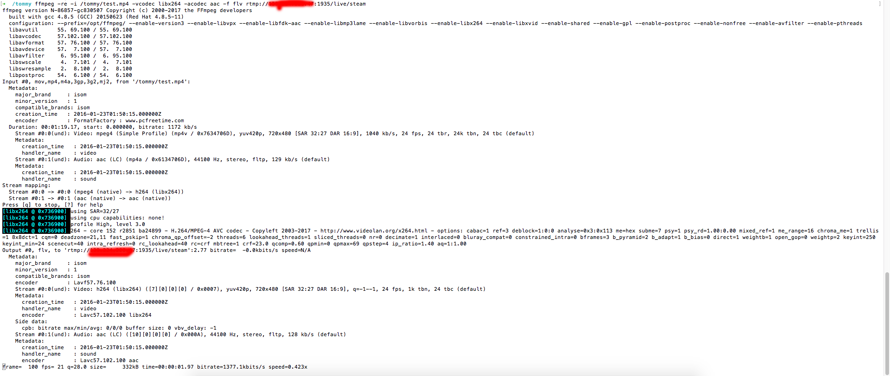
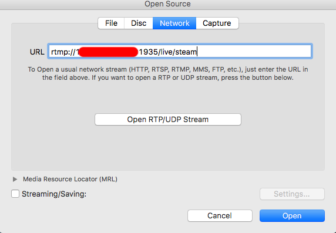
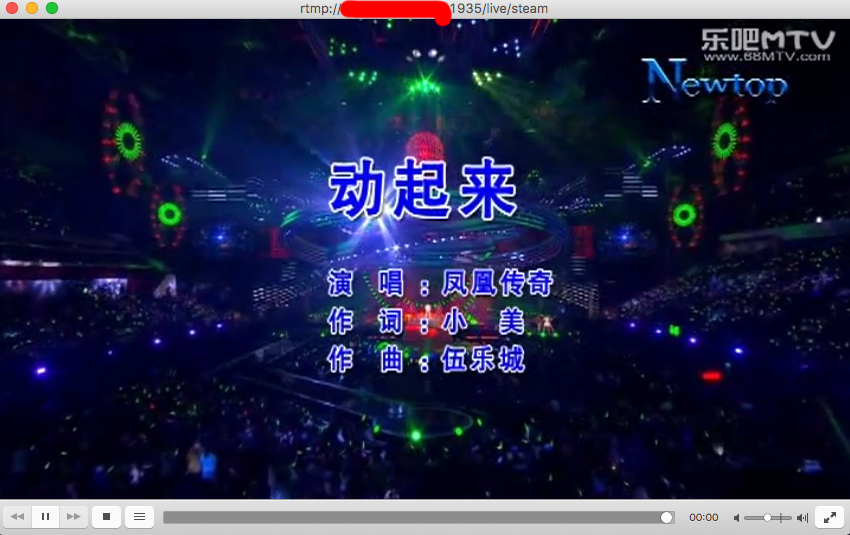
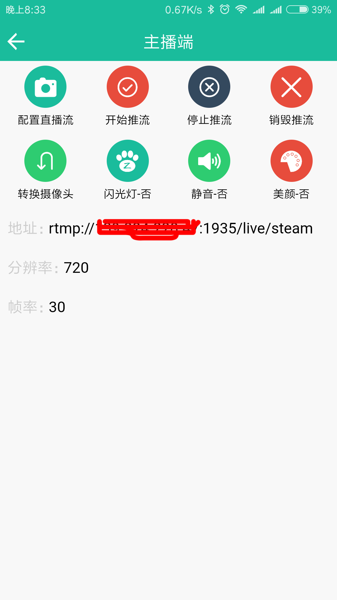
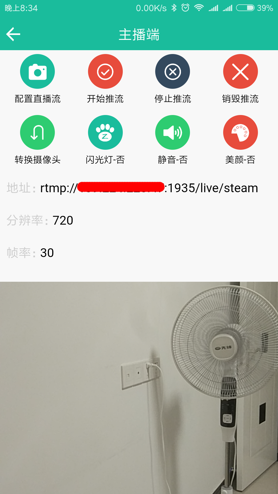
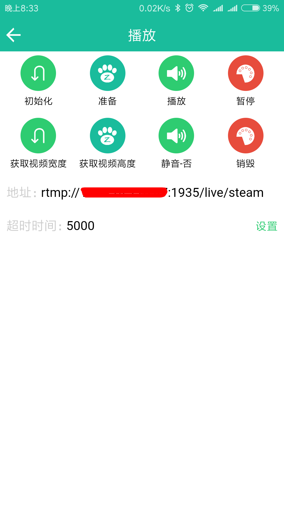
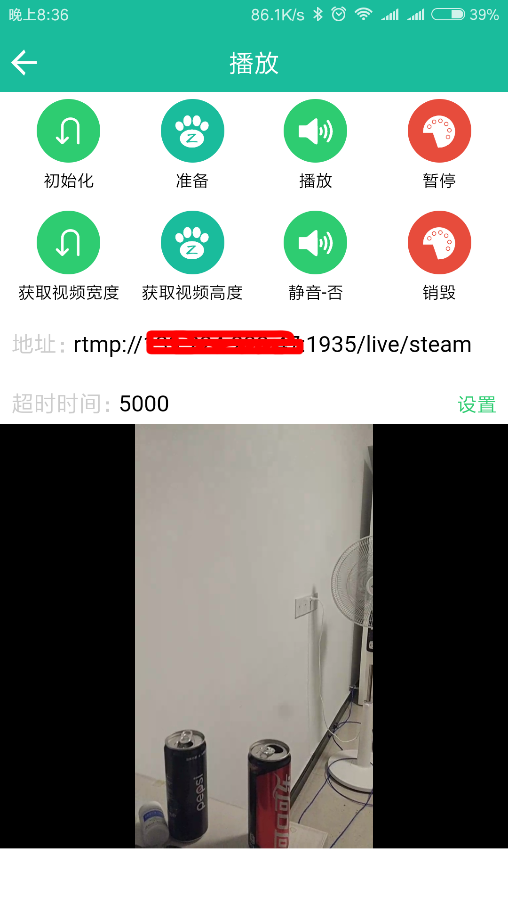

# simpleLive
使用Linux服务器搭建直播服务器，并运用Apicloud平台简易快速的制作全功能直播APP。

# 代码目录结构介绍

* `widget`文件夹里是源代码，熟悉`Apicloud`的朋友对这个文件夹都不陌生，这里面包括所用到的`aliyunLive`模块代码。具体其目录结构和代码结构需使用者自行研究。

* `app`：我作为开发者所关注并开发的部分，我编写的代码都在这里面。注意，这个目录不包含`aliyunLive`模块。

# 服务器端
### 打开相关端口

> Rtmp会使用到1935端口

1. 到阿里云后台设置本实例安全组规则开放1935端口。
2. 配置防火墙打开1935端口。

### 安装FFMPEG

1. 安装依赖包和升级相关工具

  ~~~
  yum -y install gcc glibc glibc-devel make nasm pkgconfig lib-devel openssl-devel expat-devel gettext-devel libtool mhash.x86_64 perl-Digest-SHA1.x86_64
  yum -y update gcc
  yum -y install gcc+ gcc-c++
  ~~~

2. 安装相关工具包

 * `git`

 ~~~
 yum install -y git
 ~~~

 * `zlib`

 ~~~
 yum install -y zlib
 ~~~

 * `pcre`

 ~~~
 yum install -y pcre
 ~~~

 * `yadmi`

 ~~~
 cd /
 mkdir tommy
 cd tommy
 wget http://sourceforge.net/projects/yamdi/files/yamdi/1.4/yamdi-1.4.tar.gz/download
 tar -zxvf download
 cd yamdi-1.4
 make && make install
 cd ..
 ~~~

 * `openssl`

 ~~~
 yum install -y openssl
 ~~~

3. 安装`ffmpeg`及其依赖包

 * `Yasm`

 ~~~
 wget http://www.tortall.net/projects/yasm/releases/yasm-1.2.0.tar.gz
 tar -zxvf yasm-1.2.0.tar.gz
 cd yasm-1.2.0
 ./configure
 make && make install
 cd ..
 ~~~

 * `x264`

 ~~~
 git clone git://git.videolan.org/x264
 cd x264
 ./configure --enable-shared
 make && make install
 cd ..
 ~~~

 * `LAME`

 ~~~
 wget http://downloads.sourceforge.net/project/lame/lame/3.99/lame-3.99.5.tar.gz
 tar -zxvf lame-3.99.5.tar.gz
 cd lame-3.99.5
 ./configure --enable-nasm
 make && make install
 cd ..
 ~~~

 * `libogg`

 ~~~
 wget http://downloads.xiph.org/releases/ogg/libogg-1.3.0.tar.gz
 tar -zxvf libogg-1.3.0.tar.gz
 cd libogg-1.3.0
 ./configure
 make && make install
 cd ..
 ~~~

 * `libvorbis`

 > 安装这个工具时废了很大力气，有报错，后来重复确认安装`libogg`后才成功。

 ~~~
 wget http://downloads.xiph.org/releases/vorbis/libvorbis-1.3.3.tar.gz
 tar -zxvf libvorbis-1.3.3.tar.gz
 cd libvorbis-1.3.3
 ./configure
 make && make install
 cd ..
 ~~~

 * `libvpx`

 ~~~
 git clone http://git.chromium.org/webm/libvpx.git
 cd libvpx
 ./configure  --enable-shared
 make && make install
 cd ..
 ~~~

 * `faad2`

 ~~~
 wget http://downloads.sourceforge.net/project/faac/faad2-src/faad2-2.7/faad2-2.7.tar.gz
 tar -zxvf faad2-2.7.tar.gz
 cd faad2-2.7
 ./configure
 make && make install
 cd ..
 ~~~

 * `fdk-acc`

 > 新版本的`FFMPEG`已经取消对`faac`的支持，改用`fdk-acc`进行解码，效率会更高。

 ~~~
 wget https://nchc.dl.sourceforge.net/project/opencore-amr/fdk-aac/fdk-aac-0.1.5.tar.gz
 tar -zxvf fdk-aac-0.1.5.tar.gz
 cd fdk-aac-0.1.5
 ./configure
 make && make install
 cd ..
 ~~~

 * `Xvid`

 ~~~
 wget http://downloads.xvid.org/downloads/xvidcore-1.3.2.tar.gz
 tar zxvf xvidcore-1.3.2.tar.gz
 cd xvidcore/build/generic
 ./configure
 make && make install
 cd ..
 ~~~

 * `ffmpeg`

 ~~~
 git clone https://github.com/FFmpeg/FFmpeg.git
 cd ffmpeg
 ./configure  –prefix=/opt/ffmpeg/ –enable-version3 –enable-libvpx –enable-libfdk-aac –enable-libmp3lame –enable-libvorbis –enable-libx264 –enable-libxvid –enable-shared –enable-gpl –enable-postproc –enable-nonfree  –enable-avfilter –enable-pthreads
 cd ..
 ~~~
 * 修改/etc/ld.so.conf如下:

 ~~~
 include ld.so.conf.d/*.conf
 /lib
 /lib64
 /usr/lib
 /usr/lib64
 /usr/local/lib
 /usr/local/lib64
 /opt/ffmpeg/lib
 ~~~

 然后在`/etc`目录执行相关命令

 ~~~
 cd /etc
 ldconfig
 ~~~

 * 测试`ffmpeg`

 我上传了一个`test.mp4`到`/tommy`下，使用命令查看`ffmpeg`运行情况

 ~~~
 ffmpeg -re -i /tommy/test.mp4 -vcodec libx264 -acodec aac -f flv rtmp://139.224.228.47:1935/live/steam
 ~~~

 在终端看到以下命令则证明推流成功：

 

 然后使用`VCL`(MAC端的一个播放器)等能播放`rtmp`流视频的播放器查看真正的结果是否成功：

 

 查看播放结果：

 

 如果上述都能如图显示，则证明`FFMPEG`安装和配置成功！

### 为Nginx安装nginx-rtmp-module

1. 下载`nginx-rtmp-module`

 ~~~
 cd /tommy
 git clone https://github.com/arut/nginx-rtmp-module.git
 ~~~

2. 动态添加`nginx-rtmp-module`模块

 ~~~
 wget http://nginx.org/download/nginx-1.10.2.tar.gz
 tar -zxvf nginx-1.10.2.tar.gz
 cd nginx-1.10.2
 ./configure –prefix=/usr/share/nginx –sbin-path=/usr/sbin/nginx –modules-path=/usr/lib64/nginx/modules –conf-path=/etc/nginx/nginx.conf –error-log-path=/var/log/nginx/error.log –http-log-path=/var/log/nginx/access.log –http-client-body-temp-path=/var/lib/nginx/tmp/client_body –http-proxy-temp-path=/var/lib/nginx/tmp/proxy –http-fastcgi-temp-path=/var/lib/nginx/tmp/fastcgi –http-uwsgi-temp-path=/var/lib/nginx/tmp/uwsgi –http-scgi-temp-path=/var/lib/nginx/tmp/scgi –pid-path=/run/nginx.pid –lock-path=/run/lock/subsys/nginx –user=nginx –group=nginx –with-file-aio –with-ipv6 –with-http_ssl_module –with-http_v2_module –with-http_realip_module –with-http_addition_module –with-http_sub_module –with-http_dav_module –with-http_flv_module –with-http_mp4_module –with-http_gunzip_module –with-http_gzip_static_module –with-http_random_index_module –with-http_secure_link_module –with-http_degradation_module –with-http_slice_module –with-http_stub_status_module –with-mail_ssl_module –with-pcre –with-pcre-jit –with-stream=dynamic –with-stream_ssl_module –with-debug –add-module=/tommy/nginx-rtmp-module
 cp /usr/sbin/nginx /usr/sbin/nginx.bak
 cp ./objs/nginx /usr/sbin/
 /usr/sbin/nginx -s reload
 ~~~

 3. 配置`nginx.conf`

 ~~~
 vi /etc/nginx/nginx.conf
 ~~~

 在`server`里添加

 ~~~
 rtmp {
        server {
                listen 1935;

                application live {
                        live on;
                }
        }
 }
 ~~~

 重启`nginx`

 ~~~
 /usr/sbin/nginx -s reload
 ~~~

# APP端

> 将主播端和播放端集成到了同一个`APP`中，演示时请用两部安卓手机安装，一个做主播，一个负责播放。

## 概述

1. 关于使用的平台

  http://www.apicloud.com/

2. 关于使用的模块

  `aliyunLive` 封装了阿里云视频直播的 `sdk`，该模块包括视频流采集和视频流播放两部分。如使用阿里云直播服务器搭配此模块，需要在阿里云官网注册，在控制台创建直播流，并获取播放端相关参数，详情可以参照阿里云直播官网：阿里云视频直播。

  **注意：** 该模块`android`版 播放器只适用于`android 4.4+`，推流需要 `android 4.5` 以上版本支持。`iOS`版最低版本为`8.0`。(`iOS`云编译的时候需要勾选相机和麦克风权限，并在高级设置里选择`iOS`版本为`8.0`)。

3. 技术部分

  ~~~
    HTML5
    CSS3
    JS（Vue）
  ~~~

4. 工具

  * 编辑器`Atom`
  * 直播模块`aliyunLive`，模块文档http://docs.apicloud.com/Client-API/Open-SDK/aliyunLive

## 主播部分

* 下方的地址最后一个参数`steam`可以随意更换，不同的地址可以视作不同的房间，并且观看端也配置相同的地址才能观看该房间的直播画面。

* 无论通过下方更换地址还是帧率等，都需要重新 **配置直播流** 并推流才能生效。

请依次点击“配置直播流”、“开始推流”进行直播：

## 播放部分

> 播放前必须先进行初始化，并点击准备按钮。

* 不同的地址可以视作不同的房间，只有和主播端相同的地址才能观看该房间的直播画面。

* 无论通过下方更换地址等，都需要重新 **初始化->准备** 才能生效。

